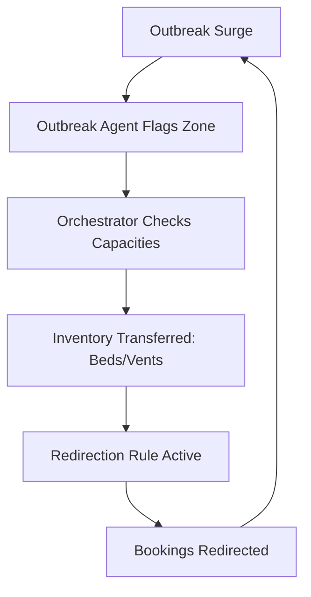

# MedTrack: AI-Powered Health Resource Management Platform

MedTrack is an intelligent, multi-agent health resource allocation and patient steering platform designed to mitigate hospital overloading during localized outbreaks. By combining symptom triage, live hospital capacities, and closed-loop resource automation, MedTrack keeps healthcare networks balanced and responsive when surges occur.

---

## 📌 The Problem

During sudden medical outbreaks (e.g., flu waves, infectious diseases, localized epidemics), healthcare networks experience severe bottlenecks. Patients rush to the nearest clinics, causing:
1. **Critical resource depletion:** Emergency beds, ICU capacity, and ventilators at key hospitals fall to zero.
2. **Staff burnout and gridlock:** Some clinics become completely overloaded while nearby sister facilities sit with spare capacity.
3. **Inefficient patient routing:** Patients continue trying to book slots at overloaded facilities because they lack real-time visibility.

## 🚀 The Solution: MedTrack

MedTrack implements a **multi-agent orchestration network** that bridges the gap between outbreak detection and resource reallocation. 

### 1. AI-Powered Triage Chatbot
A Gemini-powered symptoms checker that guides patients through an empathetic intake. It analyzes symptoms, recommends the appropriate clinic specialty, determines triage urgency levels, and warns users when emergency ER care is needed.

### 2. Proximity Hospital Finder & Booking
Allows patients to find the nearest clinics with available beds, ICU facilities, or ventilators. Patients can book appointments against real-time doctor availability calendars.

### 3. Closed-Loop Outbreak Orchestrator (Core Innovation)
When a localized outbreak is detected, the **Orchestrator Agent** takes automatic mitigation actions:
- **Redistributes Inventory:** Moves ventilators and beds from nearby spare-capacity hospitals to the overloaded outbreak epicenter.
- **Steers Patient Demand:** Instantly registers redirection rules. New bookings aimed at the overloaded hospital are auto-routed to doctors with matching specialties at the spare-capacity facility.
- **Visualizes Live:** The entire action sequence is streamed live to an interactive control dashboard.

---

## 🛠️ Technology Stack

- **Frontend:** React, Tailwind CSS v4.0 (CSS-first configuration), Lucide Icons
- **Backend:** Python FastAPI, SQLAlchemy (Object-Relational Mapping), Pytest
- **Database:** SQLite (Relational mock store containing 9 hospitals and 20+ doctors)
- **AI Triage Engine:** Gemini API (`google-genai` SDK) with rule-based local fallback

---

## 🏃 How to Run Locally

### 1. Clone & Setup Workspace
Make sure you have **Python 3.13+** and **Node.js v20+** installed.

### 2. Run the Backend API
Navigate to the `backend` folder, install requirements, and launch the Uvicorn server:
```powershell
# Navigate to backend
cd backend

# Install dependencies (if not already installed)
pip install fastapi uvicorn sqlalchemy pytest requests python-dotenv google-genai

# Run the server
python -m uvicorn main:app --reload --host 127.0.0.1 --port 8000
```
The backend API documentation will be available at `http://127.0.0.1:8000/docs`.

### 3. Run the Frontend Dashboard
Navigate to the `frontend` folder, install dependencies, and run the Vite server:
```powershell
# Navigate to frontend
cd frontend

# Install package dependencies
npm install

# Run Vite dev server
npm run dev
```
Open `http://localhost:5173` in your browser.

### 4. Run Automated Verification Tests
You can run the end-to-end multi-agent integration test using `pytest`:
```powershell
cd backend
python -m pytest test_flow.py
```

---

## ⚡ What Makes MedTrack Different?

Traditional hospital management systems are **static and passive**—they merely log resource levels.

MedTrack introduces a **closed-loop automation cycle**:


This closed loop immediately balances the load:
1. It physically boosts supply at the outbreak clinic by moving resources.
2. It throttles incoming demand by redirecting patient bookings to spare capacity sites.
3. This double-sided balancing prevents the medical system from crashing.
