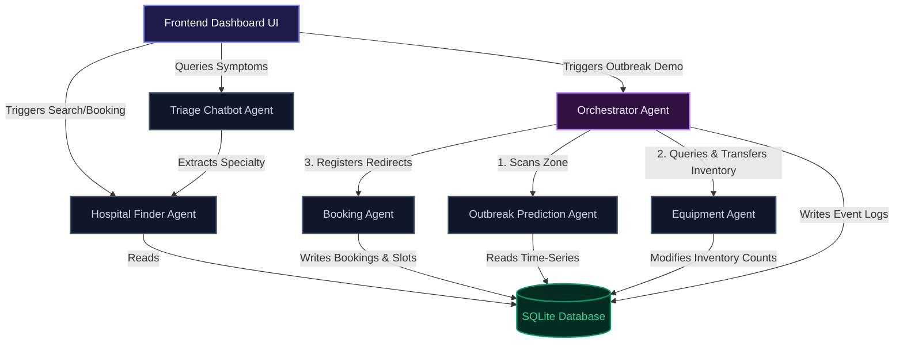

# MedTrack Multi-Agent Architecture

MedTrack is built as a network of **cooperating, specialized agents**. Each agent is designed as a modular component with clear inputs, outputs, and responsibilities. They communicate through a shared SQLite database and a central Orchestrator loop.

---

## 🤖 The Agents & Their Roles

### 1. Hospital Finder Agent (`hospital_finder.py`)
*   **Role:** Locates suitable clinics for patient intake.
*   **How it works:** Accepts user coordinates `(x, y)` and filters hospitals by primary specialty (e.g., Cardiology, Pulmonology) and resource availability. It calculates the straight-line (Euclidean) distance between the user and clinics, returning the closest matches sorted by proximity.

### 2. Booking Agent (`booking.py`)
*   **Role:** Manages appointment scheduling and locks resources.
*   **How it works:** Checks doctor calendar slots in the database. When a patient books, it decrements the available appointment slot and registers the booking. 
*   **Proactive Redirection:** If the Orchestrator has flagged a hospital as overloaded and a booking comes in for it, the Booking Agent automatically intercepts the request, redirects the patient to an available doctor at the designated spare-capacity hospital, and tags the booking status as `Redirected` in the database.

### 3. Triage Chatbot Agent (`triage.py`)
*   **Role:** Patient symptom analysis and booking guidance.
*   **How it works:** Uses the Gemini API (`gemini-2.5-flash`) to engage in conversational triage. It analyzes symptoms described by the user, determines an urgency level (Urgent, Semi-urgent, General), maps symptoms to a hospital specialty, and advises on next booking steps.
*   **Safety Guardrail:** Prepends a permanent medical disclaimer to every single chat message advising users to seek immediate ER care for critical symptoms.
*   **Fallback Resilience:** If the Gemini API is offline or has no key, it falls back to a rule-based regex analyzer so that the application never crashes during live demos.

### 4. Outbreak Prediction Agent (`outbreak.py`)
*   **Role:** Surveillance monitor for potential hotspots.
*   **How it works:** Analyzes daily case count trends per zone over the last 4 days. If the daily growth rate exceeds `20%` and the active case count crosses a volume threshold (e.g., $\ge 12$ cases), it flags the zone as `At Risk` to warn the Orchestrator.

### 5. Equipment Agent (`equipment.py`)
*   **Role:** Logistics manager for hospital assets.
*   **How it works:** Queries available inventories of general beds, ICU units, and ventilators. When commanded by the Orchestrator, it performs **atomic inventory transfers** by decrementing counts at a donor hospital and incrementing them at an recipient hospital.

### 6. Orchestrator Agent (`orchestrator.py`)
*   **Role:** Central command loop and simulation director.
*   **How it works:** Coordinates the active agents during emergency outbreaks.
    1. Spikes case counts in a target zone to simulate a sudden wave.
    2. Invokes **Outbreak Prediction Agent** to verify the hotspot.
    3. Finds **overloaded hospitals** in that zone with high occupancy (ventilators or beds depleted).
    4. Invokes **Equipment Agent** to locate nearby facilities in the same zone with spare resources.
    5. Coordinates **resource transfers** (moving assets from spare to overloaded clinics).
    6. Informs the **Booking Agent** to establish patient redirection paths.
    7. Emits a structured step-by-step log of the actions to show live on the frontend.
