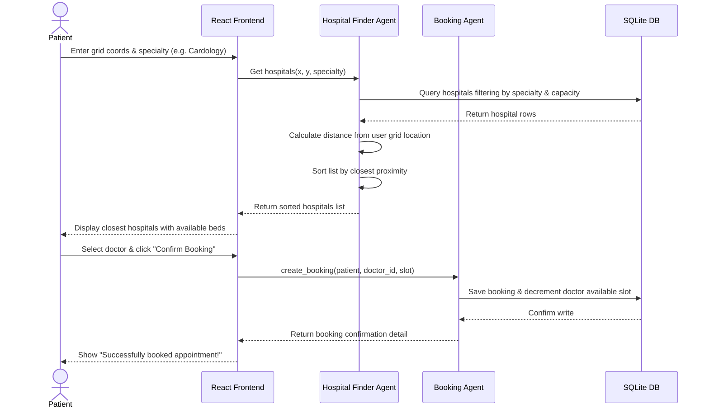
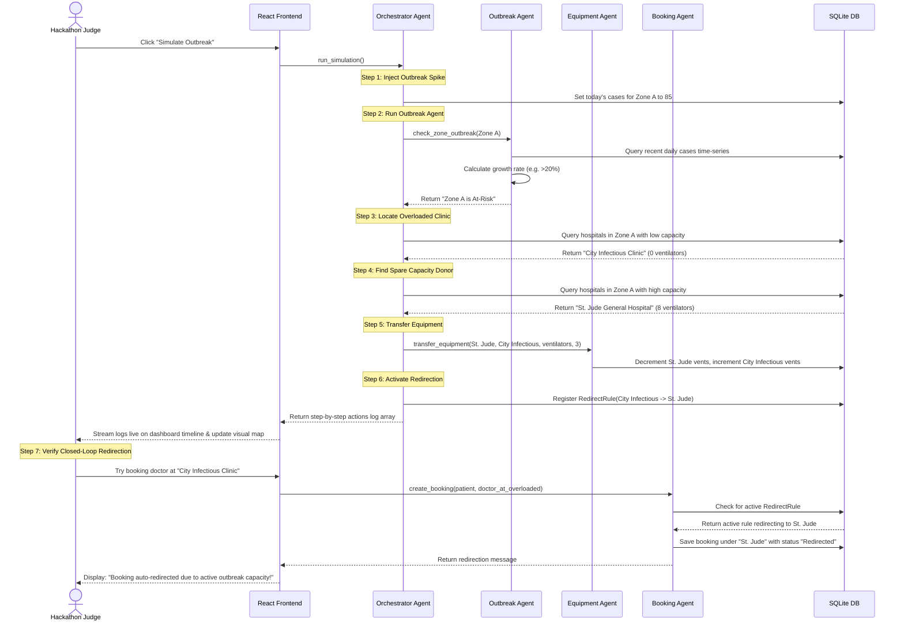

# MedTrack System Workflows

This document outlines the step-by-step logic flows for MedTrack's core features. 

---

## 🔍 Workflow A: User Search ➡️ Book Flow

This sequence demonstrates how a user searches for clinics near their grid location and books a doctor.

---

## 💬 Workflow B: Chatbot Triage Flow

This sequence shows how a user consults the AI Triage chatbot to check symptoms, which automatically recommends a specialty.

```mermaid
sequenceDiagram
    actor Patient
    participant UI as React Frontend
    participant TR as Triage Chatbot Agent
    participant AI as Gemini API (or Local Fallback)

    Patient->>UI: Type message: "I have high fever and skin rash"
    UI->>TR: triage_chat(message, history)
    
    rect rgb(20, 20, 40)
        Note over TR, AI: If Gemini API Key present
        TR->>AI: generate_content(history + message)
        AI-->>TR: Return symptoms analysis & triage recommendations
    end
    
    rect rgb(40, 20, 20)
        Note over TR: If offline or no API Key
        TR->>TR: Fallback to keyword-based symptom scanner
    end

    TR->>TR: Extract urgency level & suggested specialty (Infectious Diseases)
    TR->>TR: Prepend permanent safety medical disclaimer
    TR-->>UI: Return response text + triage suggestion data
    UI-->>Patient: Display AI response with warning disclaimer
    UI-->>Patient: Show smart shortcut: "Find Infectious Diseases Clinics"
```

---

## ⚡ Workflow C: Outbreak Reallocation Loop (End-to-End)

This sequence details the core live demonstration: spiking cases, detecting the outbreak, shifting equipment, and redirecting patient bookings.

